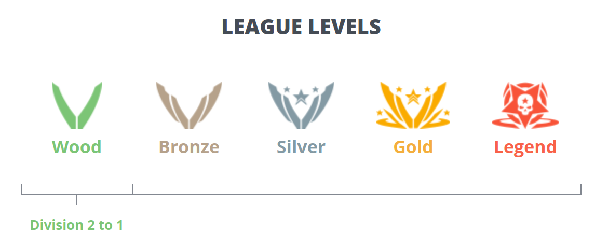
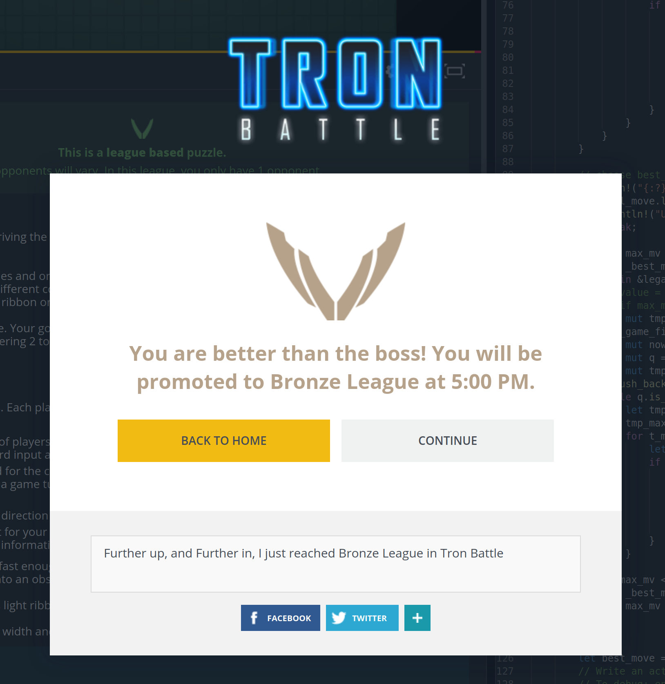

- この記事は、[広島大学ITエンジニア Advent Calendar 2020](https://adventar.org/calendars/5209) の8日目です。みんな間に合わせていてえらい。
- 今回は、ゲームAIプログラミングができるサイト [CodinGame](https://www.codingame.com/home) にチャレンジしてみました。僕はbfsを実装してヤッター！な初心者なので、お手柔らかにお願いします。

## # CodinGameってなに？
- CodinGame, 通称「こどげ」はプログラミングでゲームをして遊べるサイトのようです。よく分かっていませんが、今回紹介するゲームAI Botを作って戦わせるタイプの他にも、最適化部門もあるようです。今回は [TRON](https://www.codingame.com/multiplayer/bot-programming/tron-battle) というbotプログラミング部門の入門的な立ち位置のゲームで遊んでいきます。
- 使える言語は [こちらのFAQ](https://www.codingame.com/faq) にまとまっています。僕はRustを使うので、
```text
Rust: 1.38.0
Includes chrono 0.4.9, itertools 0.8.0, libc 0.2.62, rand 0.7.2, regex 1.3.0, time 0.1.42
```
- 今確認して知ったんですが ``rand`` crateあるやんけ！線形合同法のコードを引っ張ってきてしまった。

## # やってみる
- 2年ほど前にちょっと触った(サンプル動かした程度)ので、アカウントは作っていました。


- ``JOIN`` ボタンを押すと以下のような画面に行きます。


- 左上の ``Wood 2 League`` が自分がいるリーグです。TRONでは、 ``Wood 2`` -> ``Wood 1`` -> ``Bronze`` -> ``Silver`` -> ``Gold`` -> ``Legend`` とリーグが上がっていきます。上のリーグに行くには、各リーグの「ボス」に勝利する必要があります。一ケタ順位をとっても上にいけないな〜と思った、そこのお方！(僕のことです) ボスに勝ちにいきましょう。



- 画面の詳しい説明は [CodinGame はBOT(AIプログラム)でバトルするのが正しい楽しみ方かもしれません](https://qiita.com/javacommons/items/b178c924199d1a6d524d) を見るとよいです。
- 基本的には、コードの画面にコードを書いて、``PLAY MY CODE`` を押してテストプレイ、``TEST IN ARENA``を押して実戦、です。


## # ゲームのルール
- 光をできるだけ長く伸ばす(長い時間生き残る)と勝ちです。壁や、相手の光に当たると消滅してしまい、負けになります。

## # とりあえずサンプルを動かす
- 書いてあるものをそのままテストプレイすると、毎回左に動くのでそのまま壁に激突してTRON人生が終了します。
- これではいけません。

## # 改良の前に、コードを書くときのフレームを考える
- いろいろ書き直したり調べていると、以下のように考えるとよいことに気づきました。


- まず、ありうる手として上下右左があります(Possible Move)
- 次に、例えばいまきた道には引き返せない、壁は無理、といった制約から合法な手が決まります(Legal Move)
- 最後に、Legal Moveの中から一番よさげな手を選びます(Best Move)

## # 最初の改良
- まずはLegal Moveを実装して、Best Moveのところではランダムに選んでしまうことにしました。
- codeは長いので [うしろ](#code-1) に置きました。線形合同法は Linux Programming お気楽 Rust プログラミング超入門 さんのコードを参考にしました。ありがとうございます。
- 本質的に Best Move を選択するパートは以下になります

```rust
let best_move = legal_move[rng.rand(legal_move.len() as u32 -1) as usize];
```

- このコードでWood 1でちょっと勝てるようになりました。
- しかしボスを倒すにはまだまだ足りないようです。

## # 次の改良 bfsをしてみる
- 少し考えて、「もしかしてその場でlegal moveそれぞれに対しdfs/bfsを行い、一番遠くに行けるような手を選べば勝てるのでは？」と思いつきました。やってみましょう。
- codeは [こちら](#code-2) です。
- Best Moveを選ぶ部分は以下のようになります。bfsっぽいことをしています。
```rust
// choose best_move
// update this part
eprintln!("{:?}", legal_move);
if legal_move.len() == 0 {
    println!("UP");
    break;
}
let mut max_mv = 0;
let mut _best_move = (0,0); // invalid initial value
for mv in &legal_move {
    // value = bfs(mv.2, mv.3)
    // if max_mv < value { update(_best_move) }
    let mut tmp_game_field = game_field.clone();
    tmp_game_field[mv.3 as usize][mv.2 as usize] = false;
    let mut now = (mv.2, mv.3); // x,y
    let mut q = VecDeque::new();
    let mut tmp_max_mv = 0;
    q.push_back(now);
    while q.is_empty() == false {
        let tmp = q.pop_front().unwrap();
        tmp_max_mv += 1;
        for t_mv in &possible_move {
            let (x,y) = (tmp.0+t_mv.0, tmp.1+t_mv.1);
            if 0 <= x && x <len_x as i32 && 0 <= y && y<len_y as i32 {
                if tmp_game_field[y as usize][x as usize] {
                    // valid
                    tmp_game_field[y as usize][x as usize] = false;
                    q.push_back((x,y));
                }
            }
        }
    }
    if max_mv < tmp_max_mv {
        _best_move = (mv.0, mv.1);
        max_mv = tmp_max_mv;
    }
}

let best_move = _best_move;

```
- これでボスを倒すことができました！やったーー！次はBronzeリーグです！



## # 終わりに
- めっちゃビジュアライザが楽しいので対戦中の動画ずーっと眺めてしまいますね。
- 次の目標はsilverですが、Minimax法とか勉強しないと無理そう感あるので(ただbronzeレベルだとまだ大丈夫らしい？)勉強していかんとなあ。

## code-1
```rust
use std::io;

macro_rules! parse_input {
    ($x:expr, $t:ident) => ($x.trim().parse::<$t>().unwrap())
}

// http://www.nct9.ne.jp/m_hiroi/linux/rust02.html
struct Rand {
    seed: u32
}

// メソッドの実装
impl Rand {
    // 生成
    fn new(x: u32) -> Rand {
        Rand { seed: x }
    }

    fn rand(&mut self, rand_max: u32) -> u32 {
        let x = self.seed as u64;
        self.seed = ((69069 * x + 1) & rand_max as u64) as u32;
        self.seed
    }
}
fn convert_output(mv: (i32,i32)) -> String{
    let output = match mv {
        (1,0) => "RIGHT",
        (-1,0) => "LEFT",
        (0,-1) => "UP",
        (0,1) => "DOWN",
        _ => unreachable!(),
    };
    output.to_string()
}
/**
 * Auto-generated code below aims at helping you parse
 * the standard input according to the problem statement.
 **/
fn main() {
    let len_x = 30;
    let len_y = 20;
    let mut game_field = vec![vec![true;len_x];len_y];
    let possible_move = vec![(0,1), (1,0), (-1,0), (0,-1)];
    let mut rng = Rand::new(1);
    // game loop
    loop {
        let mut input_line = String::new();
        io::stdin().read_line(&mut input_line).unwrap();
        let inputs = input_line.split(" ").collect::<Vec<_>>();
        let n = parse_input!(inputs[0], i32); // total number of players (2 to 4).
        let p = parse_input!(inputs[1], usize); // your player number (0 to 3).

        let mut legal_move = vec![];

        for i in 0..n as usize {
            let mut input_line = String::new();
            io::stdin().read_line(&mut input_line).unwrap();
            let inputs = input_line.split(" ").collect::<Vec<_>>();
            let _x0 = parse_input!(inputs[0], i32); // starting X coordinate of lightcycle (or -1)
            if _x0 == -1 {
                break;
            }
            let x0 = _x0 as usize;
            
            let y0 = parse_input!(inputs[1], usize); // starting Y coordinate of lightcycle (or -1)
            let x1 = parse_input!(inputs[2], usize); // starting X coordinate of lightcycle (can be the same as X0 if you play before this player)
            let y1 = parse_input!(inputs[3], usize); // starting Y coordinate of lightcycle (can be the same as Y0 if you play before this player)
            game_field[y0][x0] = false;
            game_field[y1][x1] = false;
            // now: i==p, x1,y1 to longest path
            // make regal_move
            if i==p {
                for mv in &possible_move {
                    let x = x1 as i32 + mv.0;
                    let y = y1 as i32 + mv.1;
                    if 0 <= x && x <len_x as i32 && 0 <= y && y<len_y as i32 {
                        if game_field[y as usize][x as usize] {
                            // for u in 0..len_y {
                            //     eprintln!("{:?}", game_field[u]);
                            // }
                            eprintln!("x: {:?} y: {:?}", x, y);
                            legal_move.push((mv.0,mv.1));
                        }
                    }
                }
            }
        }

        // choose best_move
        eprintln!("{:?}", legal_move);
        let best_move = legal_move[rng.rand(legal_move.len() as u32 -1) as usize];
        // Write an action using println!("message...");
        // To debug: eprintln!("Debug message...");
        // eprintln!("P: {}", p);
        println!("{}", convert_output(best_move)); // A single line with UP, DOWN, LEFT or RIGHT
    }
}

```

## code-2
```rust
use std::io;
use std::collections::VecDeque;
macro_rules! parse_input {
    ($x:expr, $t:ident) => ($x.trim().parse::<$t>().unwrap())
}

// http://www.nct9.ne.jp/m_hiroi/linux/rust02.html
// struct Rand {
//     seed: u32
// }

// // メソッドの実装
// impl Rand {
//     // 生成
//     fn new(x: u32) -> Rand {
//         Rand { seed: x }
//     }

//     fn rand(&mut self, rand_max: u32) -> u32 {
//         let x = self.seed as u64;
//         self.seed = ((69069 * x + 1) & rand_max as u64) as u32;
//         self.seed
//     }
// }
fn convert_output(mv: (i32,i32)) -> String{
    let output = match mv {
        (1,0) => "RIGHT",
        (-1,0) => "LEFT",
        (0,-1) => "UP",
        (0,1) => "DOWN",
        _ => unreachable!(),
    };
    output.to_string()
}
/**
 * Auto-generated code below aims at helping you parse
 * the standard input according to the problem statement.
 **/
fn main() {
    let len_x = 30;
    let len_y = 20;
    let mut game_field = vec![vec![true;len_x];len_y];
    let possible_move = vec![(0,1), (1,0), (-1,0), (0,-1)];
    // let mut rng = Rand::new(1);
    // game loop
    loop {
        let mut input_line = String::new();
        io::stdin().read_line(&mut input_line).unwrap();
        let inputs = input_line.split(" ").collect::<Vec<_>>();
        let n = parse_input!(inputs[0], i32); // total number of players (2 to 4).
        let p = parse_input!(inputs[1], usize); // your player number (0 to 3).

        let mut legal_move = vec![];

        for i in 0..n as usize {
            let mut input_line = String::new();
            io::stdin().read_line(&mut input_line).unwrap();
            let inputs = input_line.split(" ").collect::<Vec<_>>();
            let _x0 = parse_input!(inputs[0], i32); // starting X coordinate of lightcycle (or -1)
            if _x0 == -1 {
                break;
            }
            let x0 = _x0 as usize;
            
            let y0 = parse_input!(inputs[1], usize); // starting Y coordinate of lightcycle (or -1)
            let x1 = parse_input!(inputs[2], usize); // starting X coordinate of lightcycle (can be the same as X0 if you play before this player)
            let y1 = parse_input!(inputs[3], usize); // starting Y coordinate of lightcycle (can be the same as Y0 if you play before this player)
            game_field[y0][x0] = false;
            game_field[y1][x1] = false;
            // now: i==p, x1,y1 to longest path
            // make regal_move
            if i==p {
                for mv in &possible_move {
                    let x = x1 as i32 + mv.0;
                    let y = y1 as i32 + mv.1;
                    if 0 <= x && x <len_x as i32 && 0 <= y && y<len_y as i32 {
                        if game_field[y as usize][x as usize] {
                            // for u in 0..len_y {
                            //     eprintln!("{:?}", game_field[u]);
                            // }
                            eprintln!("x: {:?} y: {:?}", x, y);
                            legal_move.push((mv.0,mv.1,x,y));
                        }
                    }
                }
            }
        }

        // choose best_move
        // update this part
        eprintln!("{:?}", legal_move);
        if legal_move.len() == 0 {
            println!("UP");
            break;
        }
        let mut max_mv = 0;
        let mut _best_move = (0,0); // invalid initial value
        for mv in &legal_move {
            // value = bfs(mv.2, mv.3)
            // if max_mv < value { update(_best_move) }
            let mut tmp_game_field = game_field.clone();
            tmp_game_field[mv.3 as usize][mv.2 as usize] = false;
            let mut now = (mv.2, mv.3); // x,y
            let mut q = VecDeque::new();
            let mut tmp_max_mv = 0;
            q.push_back(now);
            while q.is_empty() == false {
                let tmp = q.pop_front().unwrap();
                tmp_max_mv += 1;
                for t_mv in &possible_move {
                    let (x,y) = (tmp.0+t_mv.0, tmp.1+t_mv.1);
                    if 0 <= x && x <len_x as i32 && 0 <= y && y<len_y as i32 {
                        if tmp_game_field[y as usize][x as usize] {
                            // valid
                            tmp_game_field[y as usize][x as usize] = false;
                            q.push_back((x,y));
                        }
                    }
                }
            }
            if max_mv < tmp_max_mv {
                _best_move = (mv.0, mv.1);
                max_mv = tmp_max_mv;
            }
        }

        let best_move = _best_move;
        // Write an action using println!("message...");
        // To debug: eprintln!("Debug message...");
        // eprintln!("P: {}", p);

        println!("{}", convert_output(best_move)); // A single line with UP, DOWN, LEFT or RIGHT
    }
}
```